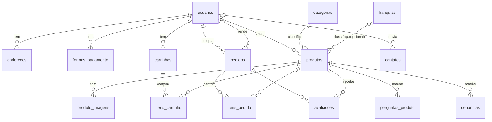

# Contratempo

Marketplace de colecionáveis, itens retrô e cultura geek, feito com
**Django 5.2** e **MySQL 8**. Qualquer usuário pode comprar e vender: anunciar
peças, receber pedidos, acompanhar entregas e avaliar o que comprou.

---

## Funcionalidades

**Vitrine**
- Home com categorias, mais vendidos e novidades
- Catálogo com filtros (categoria, franquia, condição, faixa de preço),
  ordenação e paginação
- Busca que ignora acentos e maiúsculas ("pokemon" encontra "Pokémon"),
  com várias palavras, e sugestões enquanto a pessoa digita
- Página do produto com galeria ampliada, calculadora de frete por CEP,
  perguntas ao vendedor, avaliações e produtos relacionados
- Perfil público do vendedor: nota, distribuição das avaliações, vendas,
  taxa de resposta às perguntas e todos os anúncios
- Denúncia de anúncios, analisada pela equipe no `/admin/`

**Compra**
- Carrinho salvo na conta, com aviso quando o preço ou o estoque mudam
- Checkout em 3 etapas: entrega, pagamento e revisão
- Frete por estado de destino, cobrado uma vez por vendedor
- Uma compra com vários vendedores vira um pedido para cada vendedor
- Acompanhamento do pedido, código de rastreio, confirmação de
  recebimento, cancelamento e avaliação

**Venda**
- Anúncios com até 8 fotos, condição, estoque e status (ativo, pausado,
  encerrado)
- Edição de estoque em lote
- "Minhas vendas": endereço de entrega e avanço do pedido (pagamento
  aprovado, em preparação, enviado com rastreio)
- Caixa de perguntas recebidas

**Conta**
- Cadastro com confirmação por e-mail e recuperação de senha por link
- Perfil, foto, endereços (com busca pelo CEP) e formas de pagamento
- E-mails automáticos: compra, nova venda, atualização do pedido,
  perguntas e respostas

**Institucional:** Sobre nós, Contato, Dúvidas frequentes (editáveis no
admin), Política de privacidade e páginas de erro 403, 404 e 500.

---

## Como rodar (Windows)

**Pré-requisitos:** [Python 3.10+](https://www.python.org/downloads/)
(marque *Add python.exe to PATH*). O **MySQL Server 8** é opcional: sem
ele, o projeto usa SQLite, que não precisa de servidor.

1. Dois cliques em **`instalar.bat`**. Ele:
   - cria a `venv` e instala os pacotes;
   - pergunta se a máquina tem MySQL e cria o arquivo `.env`;
   - cria o banco e aplica as migrations;
   - com SQLite, carrega os dados de `banco/dados.json`;
   - oferece criar um administrador.
2. Dois cliques em **`rodar.bat`**. Ele aplica migrations novas, liga o
   servidor e abre <http://127.0.0.1:8000>.

O painel administrativo fica em <http://127.0.0.1:8000/admin/>.

<details>
<summary><strong>Instalação manual (qualquer sistema)</strong></summary>

```bash
python -m venv venv
venv\Scripts\activate            # Linux/macOS: source venv/bin/activate
pip install -r requirements.txt
copy .env.exemplo .env           # Linux/macOS: cp .env.exemplo .env
# edite o .env (senha do MySQL ou DB_ENGINE=sqlite)
cd contratempo
python manage.py migrate
python manage.py createsuperuser
python manage.py runserver
```

Com MySQL, dá para criar o banco completo de uma vez com
`mysql -u root -p < banco/contratempo_db.sql` antes do `migrate`.
</details>

---

## Configuração (`.env`)

Cada máquina tem o próprio `.env`, na raiz do projeto. Ele **não** deve ser
copiado nem enviado ao GitHub. O modelo comentado é o `.env.exemplo`.

| Variável | Para que serve | Padrão |
|---|---|---|
| `DJANGO_DEBUG` | `1` no computador; `0` no site publicado | `1` |
| `DJANGO_ALLOWED_HOSTS` | Domínio do site publicado | vazio |
| `DJANGO_SECRET_KEY` | Chave secreta (obrigatória com `DJANGO_DEBUG=0`) | chave de desenvolvimento |
| `DB_ENGINE` | `mysql` ou `sqlite` | `mysql` |
| `DB_NAME`, `DB_USER`, `DB_PASSWORD`, `DB_HOST`, `DB_PORT` | Conexão com o MySQL | `contratempo_db`, `root`, vazio, `127.0.0.1`, `3306` |
| `EMAIL_HOST_USER`, `EMAIL_HOST_PASSWORD` | Conta do Gmail e **senha de app** | vazio (e-mails aparecem no terminal) |

**E-mail:** crie uma senha de app em
[myaccount.google.com/apppasswords](https://myaccount.google.com/apppasswords)
(exige verificação em duas etapas) e teste com
`python manage.py testar_email seu@email.com`, dentro da pasta
`contratempo`.

---

## Banco de dados

26 tabelas: 17 do marketplace e 9 internas do Django (usuários e
permissões, sessões, admin, migrations).



Tabelas independentes: `tabela_frete` (valor e prazo por UF) e
`perguntas_frequentes`.

**Regras importantes**
- **O histórico nunca se perde:** pedidos guardam uma cópia (snapshot) do
  endereço, da forma de pagamento, do nome e do preço dos itens. Mudar ou
  apagar esses dados depois não altera pedidos antigos.
- **Estoque:** a compra roda numa transação que trava o estoque dos
  produtos, e o cancelamento devolve as unidades. Um anúncio com estoque
  zero passa para "vendido".
- **Senhas** ficam como hash (PBKDF2). Cartões guardam só a bandeira e os
  4 últimos dígitos.

**Arquivos da pasta `banco/`**

| Arquivo | Uso |
|---|---|
| `contratempo_db.sql` | Cria o banco completo do zero (MySQL), com categorias, franquias, frete e FAQ |
| `atualizacao_v2.sql`, `atualizacao_v3.sql` | Atualizam um banco antigo, se você não usar o `migrate` |
| `criar_banco.py` | Usado pelo `instalar.bat` |
| `dados.json` | Seus dados exportados, para levar a outra máquina |

Para exportar os dados atuais para o `dados.json` (rode na raiz do projeto):

```bash
venv\Scripts\python.exe -X utf8 contratempo\manage.py dumpdata --natural-foreign --indent 1 --exclude contenttypes --exclude auth.permission --exclude admin.logentry --exclude sessions -o banco\dados.json
```

---

## Estrutura

```
contratemposeparado/
├── instalar.bat / instalar.ps1   instalação em uma máquina nova
├── rodar.bat                     inicia o site
├── requirements.txt              Django, mysqlclient, Pillow
├── .env.exemplo                  modelo de configuração
├── DEPLOY.md                     como publicar no PythonAnywhere
├── banco/                        scripts SQL e dados exportados
└── contratempo/                  projeto Django (manage.py)
    ├── contratempo/              settings.py, urls.py, wsgi.py
    └── marketplace/              o app
        ├── models.py             tabelas
        ├── views.py              vitrine, busca, produto, perfil do vendedor, carrinho
        ├── views_conta.py        login, cadastro, senha, perfil, endereços, pagamentos
        ├── views_checkout.py     checkout e pedidos do comprador
        ├── views_anuncios.py     anúncios e estoque do vendedor
        ├── views_vendas.py       vendas e perguntas recebidas
        ├── busca.py              busca sem acentos
        ├── frete.py              cálculo de frete
        ├── emails.py             envio de e-mails
        ├── forms.py, admin.py, urls.py
        ├── management/commands/  testar_email
        ├── migrations/           0001 a 0004
        ├── templates/            páginas, e-mails e componentes (partials/)
        └── static/               css/, js/, img/
```

---

## Comandos úteis

Rode dentro da pasta `contratempo`, com a venv ativa.

| Comando | O que faz |
|---|---|
| `python manage.py runserver` | Inicia o site |
| `python manage.py migrate` | Aplica mudanças no banco |
| `python manage.py createsuperuser` | Cria um administrador |
| `python manage.py testar_email voce@email.com` | Testa o envio de e-mail |
| `python manage.py check --deploy` | Confere as configurações de produção |

---

## Publicar na internet

Veja o **[DEPLOY.md](DEPLOY.md)**, com o passo a passo para o
PythonAnywhere (no plano gratuito sqlite, plano pago com MySQL).
